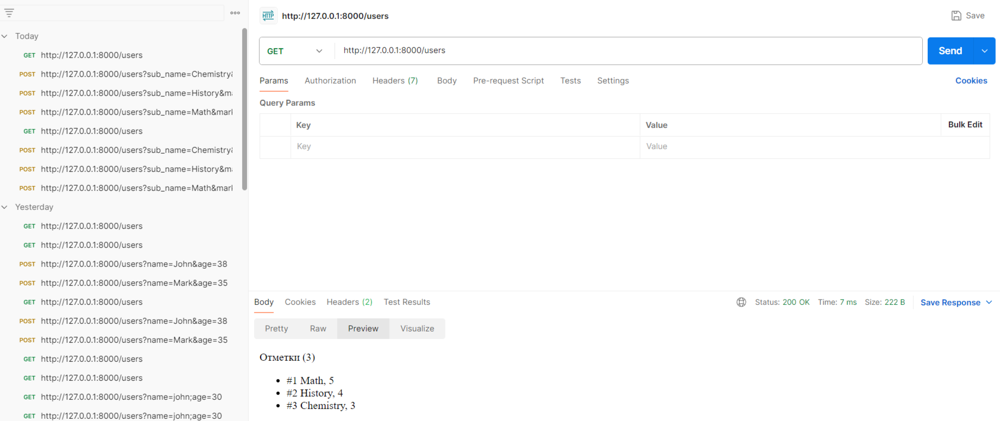

# Упражнение 5

## Описание Задачи

Необходимо написать простой web-сервер для обработки GET и POST http
запросов средствами Python и библиотеки socket.

## Код

### Код сервера
```python
import argparse
if __name__ == '__main__':
    parser = argparse.ArgumentParser()
    parser.add_argument('--bind', '-b', metavar='ADDRESS',
                        default='127.0.0.1', type=str,
                        help='Specify alternate bind address '
                             '[default: all interfaces]')
    parser.add_argument('port', action='store',
                        default=8000, type=int,
                        nargs='?',
                        help='Specify alternate port [default: 8000]')
    parser.add_argument('name', action='store',
                        default='', type=str,
                        nargs='?',
                        help='Specify alternate name [default: bind address]')
    args = parser.parse_args()

    host = args.bind
    port = args.port
    name = args.name if args.name != '' else args.bind
    serv = MyHTTPServer(host, port, name)
    try:
        serv.serve_forever()
    except KeyboardInterrupt:
        pass
```
Этот код


```python
import json
import socket
from email.parser import Parser
import Request
import Response

MAX_LINE = 64*1024
MAX_HEADERS = 100


class MyHTTPServer:
    def __init__(self, host, port, name):
        self._host = host
        self._port = port
        self._server_name = name
        self._users = {}

    def serve_forever(self):
        # 1. Запуск сервера на сокете, обработка входящих соединений
        serv_sock = socket.socket(
            socket.AF_INET,
            socket.SOCK_STREAM,
            proto=0)

        try:
            serv_sock.bind((self._host, self._port))
            serv_sock.listen()

            while True:
                conn, _ = serv_sock.accept()
                try:
                    self.serve_client(conn)
                except Exception as e:
                    print('Client serving failed', e)
        finally:
            serv_sock.close()

    def serve_client(self, conn):
        # 2. Обработка клиентского подключения
        try:
            req = self.parse_request(conn)
            resp = self.handle_request(req)
            self.send_response(conn, resp)
        except ConnectionResetError:
            conn = None
        except Exception as e:
            self.send_error(conn, e)

        if conn:
            conn.close()

    @staticmethod
    def parse_request(conn):
        # 3. функция для обработки заголовка http+запроса. Python, сокет предоставляет возможность
        # создать вокруг него некоторую обертку, которая предоставляет file object интерфейс.
        # Это дайте возможность построчно обработать запрос. Заголовок всегда - первая строка.
        # Первую строку нужно разбить на 3 элемента (метод + url + версия протокола).
        # URL необходимо разбить на адрес и параметры
        # (isu.ifmo.ru/pls/apex/f?p=2143 , где isu.ifmo.ru/pls/apex/f, а p=2143 - параметр p со значением 2143)
        rfile = conn.makefile('rb')
        raw = rfile.readline(MAX_LINE + 1)  # эффективно читаем строку целиком
        if len(raw) > MAX_LINE:
            raise Exception('Request line is too long')

        req_line = str(raw, 'iso-8859-1')
        req_line = req_line.rstrip('\r\n')
        words = req_line.split()            # разделяем по пробелу
        if len(words) != 3:                 # и ожидаем ровно 3 части
            raise Exception('Malformed request line')

        method, target, ver = words
        if ver != 'HTTP/1.1':
            raise Exception('Unexpected HTTP version')

        headers = MyHTTPServer.parse_headers(rfile)
        return Request(method, target, ver, headers, rfile)

    @staticmethod
    def parse_headers(rfile):
        # 4. Функция для обработки headers. Необходимо прочитать все заголовки после первой строки
        # до появления пустой строки и сохранить их в массив.
        headers = []
        while True:
            line = rfile.readline(MAX_LINE + 1)
            if len(line) > MAX_LINE:
                raise Exception('Header line is too long')

            if line in (b'\r\n', b'\n', b''):
                break

            headers.append(line)
            if len(headers) > MAX_HEADERS:
                raise Exception('Too many headers')

        sheaders = b''.join(headers).decode('iso-8859-1')
        return Parser().parsestr(sheaders)

    def handle_request(self, req):
        # 5. Функция для обработки url в соответствии с нужным методом. В случае данной работы,
        # нужно будет создать набор условий, который обрабатывает GET или POST запрос.
        # GET запрос должен возвращать данные. POST запрос должен записывать данные на основе
        # переданных параметров.
        if req.path == '/users' and req.method == 'POST':
            return self.handle_post_users(req)

        if req.path == '/users' and req.method == 'GET':
            return self.handle_get_users(req)

        if req.path.startswith('/users/'):
            user_id = req.path[len('/users/'):]

        if user_id.isdigit():
            return self.handle_get_user(req, user_id)

    def handle_post_users(self, req):
        user_id = len(self._users) + 1
        self._users[user_id] = {'id': user_id,
                                'name': req.query['name'][0],
                                'age': req.query['age'][0]}
        return Response(204, 'Created')

    def handle_get_users(self, req):
        accept = req.headers.get('Accept')
        if 'text/html' in accept:
            contentType = 'text/html; charset=utf-8'
            body = '<html><head></head><body>'
            body += f'<div>Пользователи ({len(self._users)})</div>'
            body += '<ul>'
            for u in self._users.values():
                body += f'<li>#{u["id"]} {u["name"]}, {u["age"]}</li>'
            body += '</ul>'
            body += '</body></html>'

        elif 'application/json' in accept:
            contentType = 'application/json; charset=utf-8'
            body = json.dumps(self._users)

        else:
            # https://developer.mozilla.org/en-US/docs/Web/HTTP/Status/406
            return Response(406, 'Not Acceptable')

        body = body.encode('utf-8')
        headers = [('Content-Type', contentType),
                   ('Content-Length', len(body))]
        return Response(200, 'OK', headers, body)

    @staticmethod
    def send_response(conn, resp):
        # 6. Функция для отправки ответа. Необходимо записать в соединение status line вида HTTP/1.1
        # <status_code> <reason>. Затем, построчно записать заголовки и пустую строку,
        # обозначающую конец секции заголовков.
        wfile = conn.makefile('wb')
        status_line = f'HTTP/1.1 {resp.status} {resp.reason}\r\n'
        wfile.write(status_line.encode('iso-8859-1'))

        if resp.headers:
            for (key, value) in resp.headers:
                header_line = f'{key}: {value}\r\n'
                wfile.write(header_line.encode('iso-8859-1'))

        wfile.write(b'\r\n')

        if resp.body:
            wfile.write(resp.body)

        wfile.flush()
        wfile.close()

    def send_error(self, conn, err):
        try:
            status = err.status
            reason = err.reason
            body = (err.body or err.reason).encode('utf-8')
        except:
            status = 500
            reason = b'Internal Server Error'
            body = b'Internal Server Error'
        resp = Response(status, reason,
                        [('Content-Length', len(body))],
                        body)
        self.send_response(conn, resp)
```


