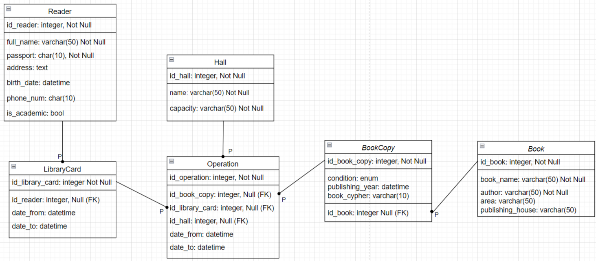
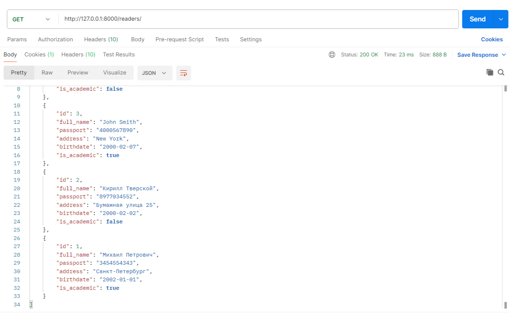

# Лабораторная работа №3

## Цель
Овладеть практическими навыками и умениями реализации web-сервисов
средствами Django.

## Описание Задачи

Реализовать сайт, используя фреймворк Django 3, Django REST Framework, Djoser и
СУБД PostgreSQL *, в соответствии с вариантом задания лабораторной работы.

## Вариант работы - 2 (библиотека). UML модель



## Реализация 

### `Models.py`

```python
from django.db import models
class Reader(models.Model):
    user = models.OneToOneField(User, on_delete=models.CASCADE)
    full_name = models.CharField(max_length=50)
    passport = models.CharField(max_length=10)
    address = models.CharField(max_length=50)
    birthdate = models.DateField()
    is_academic = models.BooleanField()

    def __str__(self):
        return self.full_name


class Hall(models.Model):
    name = models.CharField(max_length=50)
    capacity = models.IntegerField()


class LibraryCard(models.Model):
    id_reader = models.ForeignKey(Reader, on_delete=models.CASCADE)
    date_from = models.DateField()
    date_to = models.DateField()


class Book(models.Model):
    book_name = models.CharField(max_length=50)
    author = models.CharField(max_length=50)
    area = models.CharField(max_length=50)
    publishing_house = models.CharField(max_length=50)


class BookCopy(models.Model):
    CHOICES = {
        'N': 'New',
        'R': 'Regular',
        'O': 'Out of use',
    }

    condition = models.CharField(max_length=10, choices=CHOICES, default='N')
    id_book = models.ForeignKey(Book, on_delete=models.CASCADE)
    publishing_year = models.DateField()
    book_cypher = models.CharField(max_length=10)


class Operation(models.Model):
    id_book_copy = models.ForeignKey(BookCopy, on_delete=models.CASCADE)
    id_library_card = models.ForeignKey(LibraryCard, on_delete=models.CASCADE)
    id_hall = models.ForeignKey(Hall, on_delete=models.CASCADE)
    date_from = models.DateField()
    date_to = models.DateField()
```

В указанном фрагменте кода описывается реализация классов, находящихся в uml диаграмме и необходимых далее.
Из интересного здесь есть переменная с выборным значением, заданная с помощью CHOISES, также есть переменные с указанным возможным промежутком значений.
Foreign keys заданы, primary keys создаются автоматически.


Пример запроса в Postman