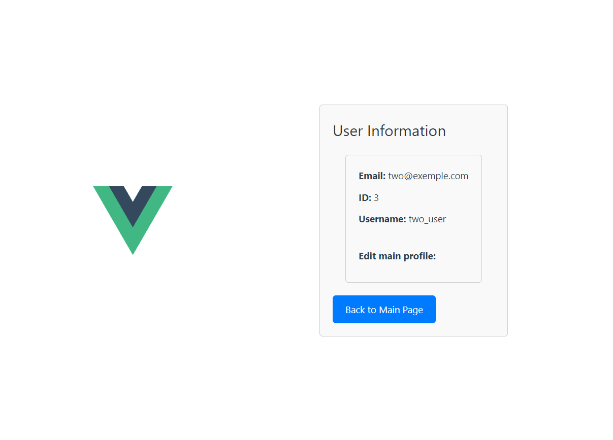
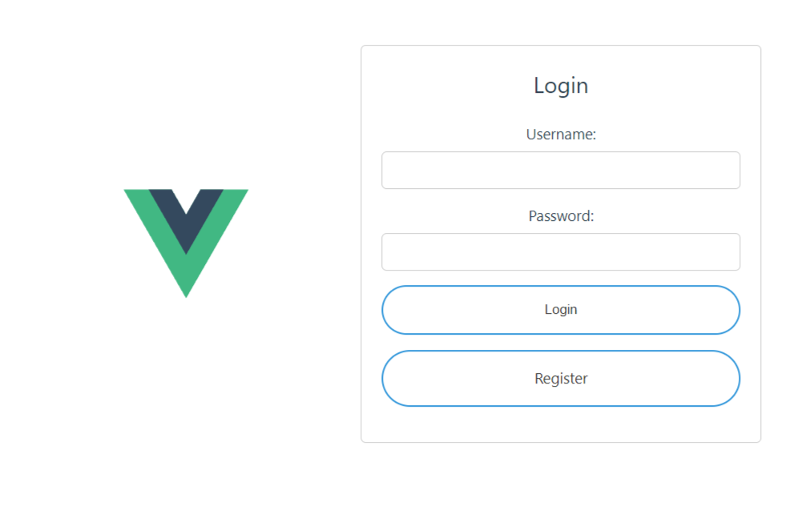

# Лабораторная работа №4


## Описание Задачи

Реализация клиентской части приложения средствами vue.js.

## Вариант работы - 2 (библиотека). UML модель
Место для модели


## Реализация 

### `Models.py`

```python
from django.db import models
class Reader(models.Model):
    user = models.OneToOneField(User, on_delete=models.CASCADE)
    full_name = models.CharField(max_length=50)
    passport = models.CharField(max_length=10)
    address = models.CharField(max_length=50)
    birthdate = models.DateField()
    is_academic = models.BooleanField()

    def __str__(self):
        return self.full_name


class Hall(models.Model):
    name = models.CharField(max_length=50)
    capacity = models.IntegerField()


class LibraryCard(models.Model):
    id_reader = models.ForeignKey(Reader, on_delete=models.CASCADE)
    date_from = models.DateField()
    date_to = models.DateField()


class Book(models.Model):
    book_name = models.CharField(max_length=50)
    author = models.CharField(max_length=50)
    area = models.CharField(max_length=50)
    publishing_house = models.CharField(max_length=50)


class BookCopy(models.Model):
    CHOICES = {
        'N': 'New',
        'R': 'Regular',
        'O': 'Out of use',
    }

    condition = models.CharField(max_length=10, choices=CHOICES, default='N')
    id_book = models.ForeignKey(Book, on_delete=models.CASCADE)
    publishing_year = models.DateField()
    book_cypher = models.CharField(max_length=10)


class Operation(models.Model):
    id_book_copy = models.ForeignKey(BookCopy, on_delete=models.CASCADE)
    id_library_card = models.ForeignKey(LibraryCard, on_delete=models.CASCADE)
    id_hall = models.ForeignKey(Hall, on_delete=models.CASCADE)
    date_from = models.DateField()
    date_to = models.DateField()
```

В указанном фрагменте кода описывается реализация классов, находящихся в uml диаграмме и необходимых далее.
Из интересного здесь есть переменная с выборным значением, заданная с помощью CHOISES, также есть переменные с указанным возможным промежутком значений.
Foreign keys заданы, primary keys создаются автоматически.

### Фронтенд проекта написан в vue
После успешной установки, можно запустить шаблон и протестировать заложенный пример.

Ниже приведён пример страницы, на которой приведено описание основной информации профиля
Кнопка Back to main page переводит на главную страницу


Далее можно наблюдать страницу авторизации пользователей


### Скрипт страницы регистрации
```
<template>
    <div class="registration-container">
      <h2>Registration</h2>
      <form @submit.prevent="register">
        <label for="newUsername">Username:</label>
        <input v-model="newUsername" type="text" id="newUsername" required />

        <label for="newEmail">Email:</label>
        <input v-model="newEmail" type="email" id="newEmail" required />


        <label for="newPassword">Password:</label>
        <input v-model="newPassword" type="password" id="newPassword" required />
  
        <button type="submit">Register</button>
      </form>
    </div>
  </template>
  
  <script>
  import axios from 'axios';
  
  export default {
    name: 'Registration',
    data() {
      return {
        newUsername: '',
        newEmail: '',
        newPassword: '',
      };
    },
    methods: {
      async register() {
        try {
          // Отправляем запрос на регистрацию
          const response = await axios.post('http://127.0.0.1:8000/register/', {
            username: this.newUsername,
            email: this.newEmail,
            password: this.newPassword,
          }, {
            headers: {
              'Content-Type': 'application/json',
              'Accept': 'application/json',
            },
          });
  
          // При успешной регистрации выводим сообщение (можно изменить)
          alert('Registration successful!');
  
          // Перенаправляем на страницу авторизации
          this.$router.push({ name: 'Auth' }).catch(() => {}); // Обрабатываем возможные ошибки
        } catch (error) {
          // Выводим сообщение об ошибке (можно изменить)
          alert('Registration failed. Please try again.');
          console.error(error);
        }
      },
    },
  };
  </script>
  
  <style scoped>
  .registration-container {
    width: 200%;
    max-width: 400px;
    margin: 0 auto;
    text-align: center;
    padding: 20px;
    border: 1px solid #ccc;
    border-radius: 5px;
  }
  
  .registration-container h2 {
    margin-bottom: 20px;
  }
  
  form {
    display: flex;
    flex-direction: column;
  }
  
  label {
    margin-bottom: 5px;
  }
  
  input {
    margin-bottom: 10px;
    padding: 10px;
    box-sizing: border-box;
    border: 1px solid #ccc;
    border-radius: 5px;
  }
  
  button {
    cursor: pointer;
    background-color: #3498db;
    color: #fff;
    border: none;
    padding: 20px;
    border-radius: 30px;
    transition: background-color 0.3s;
  }
  
  button:hover {
    background-color: #1e6ea9;
  }
  </style>
```
Стиль - это разметка страницы, скрипт отвечает за получение данных, а template - шаблон вывода данных на страницу